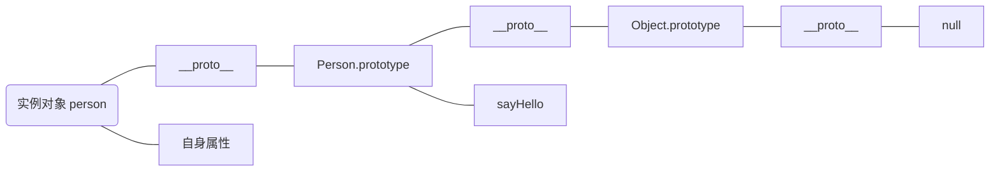

###  JS数据类型 ([ref](https://zhuanlan.zhihu.com/p/95534245))
1. 基本数据类型：Undefined, Null, Number, String, Boolean, Symbol(ES6), BigInt(ES11)
2. 复杂数据类型：Object
```
typeof Number = "number"
typeof NaN = "number"
typeof String = "string"
typeof Object = "object"
typeof Array = "object"
typeof null = "object"
typeof Function = "function"
typeof Undefined = "undefined"
typeof Boolean = "boolean"
typeof Symbol = "symbol"
typeof BigInt("1") = "bigint"
```

---
###  Symbol
1. 不使用new是因为通过new实例化的结果为object对象
    ```js
    const s = Symbol() // typeof s = 'symbol'
    ```
2. 即使传入相同的参数生成的symbol值也不一样（独有）
    ```js
    const foo = Symbol('foo')
    const bar = Symbol('foo')
    console.log(foo === bar) // false
    ```
3. 使用Symbol.for可校验上下文是否存在使用该方法且相同参数创建的symbol值
    ```js
    const s1 = Symbol.for('foo')
    const s2 = Symbol.for('foo')
    console.log(s1 === s2) // true
    ```

---
### 普通函数与箭头函数
- 箭头函数没有**自己的**this，只从自己作用域链的上一层继承this。``call``、``apply``和``bind``等方法不能改变箭头函数中``this``的指向
  ```js
  var id = 'apple'
  let func = () => { console.log(this.id) }
  func() // 'apple'
  func.call({id: 'pineapple'})  // 'apple'
  ```
- 普通函数则引入了bind方法来设置函数this值
    ```js
    function Person () {
      this.age = 0
      setInterval(function growUp() {
        console.log(this.age)  // this不一样
      }, 1000)
    }
 
    function People () {
      this.count = 0
      setInterval(() => {
        console.log(this.count) // 0
     })
    }
    ```
- 箭头函数不能作为构造函数，即不可new
- 箭头函数不能使用arguments对象，可使用rest参数代替`...rest`
  - 箭头函数没有**自已的**<code>this</code>, <code>arguments</code>, <code>super</code>或<code>new.target</code>
  - ```...rest```来自于父作用域（this也一样)
    ```js
    function foo1 () {
      console.log(arguments)
    }
    function foo2 () {
      setTimeout(() => {
        console.log(...rest)
      }, 1)
    }
    foo1(1, 2, 3, 4) // ReferenceError: arguments is not defined
    foo2(1, 2, 3, 4)//[1,2,3,4]
    ```
- 箭头函数不可命名用yield命令，因此箭头函数不能作为generator函数
    ```js
    'use strict'
    var obj = {
      i: 10,
      b: () => console.log(this.i, this),
      c: function() {
        console.log(this.i, this)
      }
    }
    obj.b() //undefined, Window{...}
    obj.c() //10, Object{...}
    ```

---
### ``function Person()`` vs ``const person = Person()`` vs ``const person = new Person()``
- ``function Person()``：定义一个函数，可以当一个常规函数或者构造器(constructor)来使用
- ``const person = Person()``：调用 ``Person()``作为常规函数，当没有返回值时，因为没有构造函数，所以会导致结果为``undefined``
- ``const person = new Person()``：创建``Person()``的新实例，使用其作为构造器
```js
function Person(name) {
  this.name = name
}

const person = Person('Asshole')
console.log(person) // undefined
console.log(person.name) // Uncaught TypeError: Cannot read property 'name' of undefined

const person2 = new Person('Mark')
console.log(person) // Person {name: 'Mark'}
console.log(person) // 'Mark'
// person2的new过程替代
const person3 = Object.create(Person.prototype) // 以Person.prototype作为原型创造新对象
Person.call(person3, 'Luke')
```

| 类目 | ``function Person()`` | ``const person = Person()`` | ``const person = new Person()`` |
|----|-------------------|------------------------|-----------------------------------|
| 类型 | 函数定义   | 函数调用                   | 构造器调用                             |
| 用法 | 定义函数    | 将``Person()``作为常规函数调用   | 使用``Person()``作为构造器创建新实例  |
| 实例 | 不创建      | 不创建                    | 创建                                |

---
### ``function foo()`` vs ``var foo = function() {}``
- ``function foo()``是函数定义，会有函数提升
```js
foo() // 'FOOOOOOO'
function foo() {
  console.log('FOOOOOOO')
}
```
- ``var foo = function() {}``是函数表达式，无函数提升（但``var``会变量提升）; 当表达式内的函数命名时，仅能从函数内访问自身，否则会导致报错或者undefined
```js
foo() // Uncaught TypeError: foo is not a function
var foo = function () {
  console.log('FOOOOOO')
}
const myFunc = function namedFunc() {
  console.log(namedFunc) // 正常执行
}
console.log(namedFunc) // undefined
```

---
### 匿名函数
- 可防止变量污染
```js
(function () {
  var x = 10
  console.log(x) // 10
})()
console.log(typeof x) // undefined
```


---
###  深拷贝和浅拷贝
- 浅拷贝：指两个js对象指向同一个内存地址，其中一个改变会影响另一个。浅拷贝只会拷贝一层，深层的引用类型改变还是会受到影响。
    ```js
    let oldObj = {1: 'a', 2: 'b'}
    let oldObj2 = {1: 'c', 3: 'd'}
    let newObj1 = Object.assign({}, oldObj)
    let newObj2 = {...oldObj}
    // merge object
    let newObj3 = {...oldObj, ...oldObj2} // {1: 'c', 2: 'b', 3: 'd'}
    // array slice 
    let arr = [...arr1, ...arr2]
    ```
- 深拷贝：指复制后的新对象重新指向一个新的内存地址，两个对象改变互不影响。
    ```js
    //不含函数
    let oldObj = {1: 'a', 2: 'b'}
    console.log(JSON.parse(JSON.stringify(oldObj)))
    const deep_clone = obj => {
      let ret, k, b;
      // instanceof 检测构造函数的prototype属性是否出现在某个实例对象原型链上
      if ((b = obj instanceof Array) || obj instanceof Object) {
        ret = b ? [] : {};
        for (k in obj) {
          if (obj[k] instanceof Array || obj[k] instanceof Object) {
            ret[k] = deep_clone(obj[k]);
          } else { 
            ret[k] = obj[k];
          }
        }
      }
      return ret;
    };
    ```
- 不使用```JSON.parse(JSON.stringify(Object))``` 深拷贝的原因：
  - ```JSON.stringify```仅可序列化对象可枚举的自有属性
    - 如果对象中有构造函数生成的，使用```JSON.parse(JSON.stringify(Object))```会丢失对象```constructor```
    - 对象中有时间对象，则时间会被parse成字符串而非时间对象
    - 对象中有```RegExp```, ```Error```对象时，序列化的结果只能得到空对象
    - 对象中有```函数```或```undefined```时则会丢失
    - 对象中有```NaN```， ```Infinity```和```-Infinity```时，序列化结果变为```null```
    - 对象中存在循环引用时无法正确深拷贝
---
### 变量声明方法
- ES5: ```var```, ```function```
- ES6: ```var```, ```function```, ```let```, ```const```, ```import```, ```class```

1. ```let```, ```const```两者均无变量提升，所以必须声明前调用后。```var```有变量提升，因为前后无影响
2. ```let```只在声明的代码块内有效， ```const```为常量
3. ```let```, ```const```不允许重复声明
4. for使用let时，```循环let```和```内部let```为两个父子作用域
    ```js
    for(let i = 0; i < 3; i++) {
      let i = "abc"
      console.log(i)
    }
    //输出三次"abc"
    ```
5. ```const```不允许声明后再赋值，保证指针是固定的，但指针指向的数据结构是可变的，因此以下两种情况都对
    ```js
    const x = 7
    
    const a = {}
    a.b = 9
    
    const c = []
    c.push(9)
    c.length = 0
    ```

---
###  切换浏览器导航或最小化窗口时监听 ([ref](https://developer.mozilla.org/zh-CN/docs/Web/API/Page_Visibility_API))
```js
document.addEventListener("visibilitychange", function(ev) { 
  console.log(document.hidden)
})
```

---
### 继承
1. **原型链继承**：将父类实例作为子类原型
   - 优点：父类方法可复用
   - 缺点：父类引用属性会被子类共享；子类构建实例时不能向父类传参
    ```js
    SubType.prototype = new SuperType()
    SubType.prototype.constructor = SubType
    ```
2. **构造函数继承**： 父类构造函数内容复制给子类构造函数（唯一不涉及到prototype的继承）
   - 优点：父类引用属性不会被子类所共享；子类构建时可向父类传参
   - 缺点：父类方法不能复用，子类实例方法每次都为单独创建
    ```js
    SuperType.call(SubType)
    ```
3. **组合继承**：原型链+构造函数
   - 优点：父类方法可被调用；父类引用属性不会被共享；子类构建实例时可向父类传参
   - 缺点：多次调用父类构造函数，性能浪费
    ```js
    function SuperType () {
      this.name = 'parent'
      this.arr = [1, 2, 3]
    }
    SuperType.prototype.say = function() {
      console.log('this is parent')
    }
    function SubType () {
      SuperType.call(this) // 第二次调用 
    }
    SubType.prototype = new SuperType() // 第一次调用
    ```
4. **原型式继承**：object对参数对象的浅拷贝
   - 优点：父类方法可复用
   - 缺点： 父类引用属性会被所有子类实例共享；子类构建实例时不能向父类传参
5. **寄生式继承**：在原型式继承基础上增强浅复制能力
6. **寄生组合继承**：解决组合继承的缺点
7. **ES6 Class extends**
   - 本质上是ES5继承的语法糖
   - ES6继承中子类的构造函数的原型链指向父类的构造函数，ES5中仅为复制无原型链指向
   - class必须使用``new``来创建实例，普通构造函数也可不使用
   - class内部定义的方法不可枚举，普通构造函数可枚举
   - class内部默认即为严格模式
   - class不存在变量提升
- ES5:
    ```js
    function Point(x, y) {
      this.x = x
      this.y = y
    }
    Point.prototype.toString = function() {
      return "(" + this.x + ", " + this.y + ")"
    }
    var p = new Point(1, 2)
    //可枚举
    Object.keys(Point.prototype) // ["toString"]
    Object.getOwnPropertyNames(Point.prototype) // ["constructor", "toString"]
    ```
- ES6 class:
    ```js
    //属性名可采用表达式
    let methodName = "getPosition"
    class Point {
      //constructor如未被显式定义，会默认添加个空的constructor()方法，new创建对象实例自动调用该方法
      //constructor默认返回实例对象(this)
      constructor(x, y) {
        this.x = x
        this.x = y
      }
      toString() {
        return "(" + this.x + ", " + this.y + ")"
      }
      [methodName]() {
        return "(" + this.x + ", " + this.y + ")" 
      }
    }
    let p = new Point(1, 2)
    typeof Point // "function"
    Point === Point.prototype.constructor //true
    //在类实例上调用方法等同于调用原型上的方法
    p.constructor === Point.prototype.constructor //true
    //向类添加多个方法
    Object.assign(Point.prototype, {
      toValue(){},
      showDiff(){}
    })
    //不可枚举性
    Object.keys(Point.prototype) //[]
    Object.getOwnPropertyNames(Point.prototype) // ["constructor", "toString", "getPosition", "toValue", "showDiff"]
    ```
- 对比
    ```js
    class Point {
      constructor() {}
      toString() {}
      toValue() {}
    }
    //等同于
    Point.prototype = {
      constructor() {},
      toString() {},
      toValue() {}
    }
    ```
- class constructor 返回另外的对象
    ```js
    class Foo {
      constructor() {
        return Object.create(null)
      }
    }
    new Foo() instanceof Foo //false
    ```

---
### 模块化
- ES6, CommonJS, CMD, AMD
- 模块内部数据与实现是私有的，向外部暴露一些接口方法与外部其它模块通信
- 优势：减少命名空间污染，更好的分离，按需加载，高复用性，高可维护性
- 引入多个script标签后的问题：请求过多，依赖模糊
> **全局function模式**: 污染全局命名空间，容易引起冲空或数据不安全，模块成员间看不出直接联系
>
> **namespace模式**: 减少全局变量，解决命名冲空，数据不安全，外部可直接修改内部数据
>
> **IIFE模式**: 立即调用函数表达式（闭包），将数据及方法封装到一个函数内部，通过给window添加属性来向外暴露接口
1. **CommonJS**: ```require```
   - Node应用模块采用了此种方式，每个文件为一个模块，有自己的作用域，文件内变量、函数、类私有，在服务器端是同步加载，浏览器端需要提前编译打包 browserify
   - 不会污染全局作用域
   - **在运行时加载函数**，只在运行能确定依赖关系及输入输出
   - 模块只在第一次加载时运行，运行结果缓存，多次加载需要清缓存
   - 模块加载顺序按在代码中出现的顺序
   - 输入为被输出值的拷贝，输出后模块内部变化无法再影响此值(值传递或引用传递)
    ``` js
    //output 
    module.export = value 
    module.xxx = value
    //import
    require("xxx") //file name or file path
    // 过程
    let { exists, readfile } = require("fs")
    // 等同于下述代码，运行时才能得到对象，因此无法在编译时静态优化
    // 这个过程为整体加载fs模块（加载所有的fs方法），生成对象_fs， 再从_fs读取这两个方法
    let _fs = require("fs")
    let exists = _fs.exists
    let readfile = _fs.readfile
    ```
2. **ES6**
    - import: default为独有关键字，导入为强绑定
    - **编译的过程中加载**，因为为了实现静态化，尽可能在运行前就知道依赖关系，输入和输出变量
    ```js
    export { func1, func2, func3 }
    // 仅引入加载了这两个方法，其他方法不加载
    // 引入的模块必须存在，因为编译时必须要读取里面的内容查验，不能出现在运行if else里
    import { func1, func2 } from ".."
    import foo from "./foo.js"
    // 与commonJS相异处：commonJS在编译的时候不管对方是否存在（不校验），可以运行时才去读取
    if (condition) {
      foo = require("./foo.js")
    }
    ```
3. **AMD**
   - 非同步，浏览器端常用
   - 会发送多个请求，且依赖顺序不能错 ，require.js可解决
   - 只在运行能确定依赖关系及输入输出
    ```js
    define(function() { 
      return 模块
    })
    define(['module1', 'module2'], function() {})
    require(['module1', 'module2'], function () {})
    ```
4. **CMD**
   - CommonJS和AMD的结合，加载异步，使用时才执行，用于浏览器端（例sea.js）

---
###  cacheStorage 和 cache
- **cacheStorage**: 类似mango, 管理所有cache
- **cache**: 类似mango内的db

---

### 服务器通信
1. XMLHttpRequest: 可获取任何类型的数据，可支持HTTP外的协议（FTP，file://）
2. EventSource: 服务器单向推送，一个EventSource实例会对HTTP服务开启持久化连接，以text/event-stream格式发送事件，应用于处理社交媒体更新，新闻提要等
3. Websocket: 全双工通信([ref](http://websocket.org/aboutwebsocket.html))
    - 握手由HTTP进行，此后于HTTP无关
    - 通道由client发起HTTP连接，服务器收到后打开对应的HOST TCP/IP连接。通道建立后可以无阻挡地通过代理Proxy
    - client通过```Upgrade:websocket```告知服务器，服务器接收后同意将协议转为websocket（响应```101状态码```），然后HTTP连接终止并被websocket连接替代
    - socket.io使用：options.transports指定类型，可选websocket, polling, polling-xhr, polling-jsonp，[demo](https://github.com/ErgoSphere/es-plugins/blob/master/src/api/socket.js)
    - ``websocket``实现兼容低版本浏览器
      - 长轮询XHR
      - 其于multipart发送XHR
      - IE: ActiveX HTMLFile
      - Adobe Flash Socket(已停止)

---
###  多标签通信
1. [websocket](#服务器通信)
2. localStorage event
3. postMessage
4. SharedWorker: 特定类型worker，如几个窗口、iframe或其他worker，必须同源，

---
###  输入网址后浏览器做了什么事(浏览器渲染过程)
- **请求过程**
    1. 搜索浏览器自身DNS缓存，如有缓存直接访问已缓存的IP地址
    2. 无缓存，搜索系统自身DNS缓存，读取HOST文件，是否有DNS IP地址映射
    3. 向运营商发送DNS解析请求，获得IP地址
    4. 向IP地址所在server进行3次TCP握手建立连接
    5. 建立连接之后向server发送HTTP请求
    6. server接收请求后将处理结果发回，如HTML页面代码等
    7. client的内核和JS引擎解析和渲染页面，内含的JS，CSS，图片等资源也将通过HTTP请求进行加载
    8. client根椐拿到的资源进行页面渲染呈现给用户，如无后续操作则向服务器端发起TCP四次挥手断开
- **渲染过程**（上述7, 8时进行）
    1. 解析收到的文档，根椐文档的内容构建DOM树（DOM元素 + 属性节点）
    2. 根椐CSS生成CSSOM规则树
    3. 根椐DOM树和CSSOM规则树生成渲染树（render tree）。渲染对象为渲染树的节点，是一个含大小颜色的矩形。渲染对象与DOM对象相对应（非一对一），不可见的DOM对象不会被插入渲染树。
    4. 生成渲染树后，浏览器会根椐渲染树进行布局（回流/自动重排）
    5. 布局完成后进行绘制（对象paint）
- **浏览器渲染方式**： Flow Based Layout
- 由于浏览器使用流式布局，对Render Tree的计算通常只需要遍历一次就可以完成，但table及其内部元素除外，他们可能需要多次计算，通常要花 3 倍于同等元素的时间

---
###  ES6转ES5思路及babel原理
- 代码字符串解析成AST（抽象语法树/Abstract Syntax Tree）: ES6 AST → ES5 AST → 再次生成代码字符串
- babel转译：解析parse → 转换transfer(babel-traverse) → 生成generate (babel-generator)

---
###  异步解决方案
1. 回调函数：无法catch错误
2. promise: 无法取消promise（网络请求已发出
    - 可通过返回reject来实现中断的处理
3. Generator: 可以控制函数执行
    - yield
4. await/async: 将异步改为同步，当异步无依赖性而使用时性能降低
    - Generator语法糖

---
### 浏览器缓存
1. service worker: 需要用https访问
2. memory cache: 内存中的缓存，随着进程释放（tab关闭）而消失
3. disk cache
4. push cache: HTTP/2内容，仅存在于session中

---
###  网站性能优化
1. 合并请求资源：如雪碧图，文件合并，base64
2. DNS缓存/缓存策略
3. 延迟加载，减少首屏加载: 如将图片地址存在data属性中，当滚动到可视区域时再赋值src
4. 用户行为触发
5. CDN
6. Gzip
7. 减少cookie大小

---
###  在用户关闭页面前向服务器发送信息
unload event
1. 在事件中发送异步请求：失败
2. 在事件中发送同步xhr：延迟页面卸载
3. 在事件中使用image src：延迟页面卸载
4. 在事件中使用创建个几秒中的no-op循环来延迟页面卸载并向服务器发送信息
5. （最优解）<code>navigator.sendBeacon</code>: 通过HTTP将少量数据**异步**传输到服务器

---
###  [MVVM, MVC, MVP](https://www.ruanyifeng.com/blog/2015/02/mvcmvp_mvvm.html)
1. **MVC**
    - Model → View → Controller → Model : 单向通信
    - view发送指令到controller, controller完成业务逻辑，要求model改变状态，然后model将新数据发送到view, 用户得到反馈
2. **MVP**
    - View ⇋ Presenter ⇋ Model : 双向, view 不和 Model通信
3. **MVVM**
    - Model ⇋ View ↔︎ ViewModel: Model与View双向通信，view和ViewModel双向绑定

---
###  JS对象转换
1. 对象到字符串
    - 如对象有toString()，则调用该方法
    - 如无toString()或此方法不返回一个原始值，则调用valueOf()
    - 两者都无，此时抛出一个类型错误异常
2. 对象到数字
    - 如有valueOf()，则调用该方法
    - 如无valueOf()，则调用toString()
    - 两者都无，此时抛出一个类型错误异常

---
###  Get请求传参长度限制
- HTTP协议未作规定，最大长度是浏览器和服务器限制URI的长度，不同的浏览器和服务器限制的长度不一样
- 要支持IE，则最大长度为2083byte，若只支持chrome，则最大长度为8182byte

---
###  为什么使用setTimeout实现setInterval
setInterval是将事件放在任务队列中，当空闲时才取事件执行，如果有执行栈时间过长，多个计时器则不能按指定时间执行任务

---
###  URL和URI的区别
- URI：统一资源标识符，http://www.xxx.com/html/html1, 命名机制+主机名+资源自身路径
- URL：统一资源定位器，http://www.11.com:9000/aaa, schema://host:port/path, schema有http, ftp, gopher等
- URN：统一资源命名：mailto:java-net@java.sun.com
- URL和URN是URI的子集

---
### 事件委托、事件流传播过程
- 事件捕获 → 事件目标 → 事件冒泡
- ``document.addEventListener(..., capture)``, capture为boolean， true为捕获，false为冒泡
- 不支持冒泡的事件
  - focus, blur(element)
  - mouseenter, mouseleave(element)
  - resize, scroll(window)
  - load, unload(window)
- 中断事件传播
  - addEventListener(eventName, callback, {once: true})
  - addEventListener(eventName, e => e.stopImmediatePropagation())

---
### ```Reflect.ownKeys```vs ```Object.keys```
- 两者都得到对象属性的集合，以数组形式返回
- ``Reflect.ownKeys``是所有属性，包括**不可枚举属性**和**symbol**；``Object.keys``仅包含**可枚举属性**

---
###  class的继承和prototype的继承一样吗
- class为ES6继承，prototype为ES5的原型链继承
- class的子类没有自己的this对象，先创造父类的this对象（所以先调用super），再用子类的构造函数修改this
- prototype实质为先创造子类的this对象，再将父类方法通过Parent.apply(this)添加到子类上
- class内部定义的方法不可枚举，不存在变量提升

---
###  map和object比较
- [https://developer.mozilla.org/zh-CN/docs/Web/JavaScript/Reference/Global_Objects/Map](https://developer.mozilla.org/zh-CN/docs/Web/JavaScript/Reference/Global_Objects/Map)
- map可使用forEach遍历，但无法使用for循环，map.length为0，需要获取长度使用map.prototype.size

---
###  JS递归深度限制
由浏览器限制行为，超过浏览器限制出现堆栈溢出

---

###  Uint8Array 和 Uint8ClampedArray
- 皆常用于canvas
- Uint8ClampedArray主要用于canvas特殊场景，如imageData
- 如果输入值为0～255整数，则两者结果一致
- Uint8Array的转换逻辑为ToUint8，输入数转化为正整数，不进行四舍五入
- Uint8ClampedArray的转换逻辑为ToUint8Clamp，负数归入0，大于255的数归入255，不直接取整，采用银行家舍入

---
###  Reflect
1. 能避免某些Object方法造成的抛错，如Object.defineProperty修改不可写的对象时会抛错，而Reflect.defineProperty(obj, name, desc)会正常运行返回false。
2. 与Proxy对象方法一一对应，避免如Proxy默认行为被修改，总可以在Reflect上获取默认行为

---
###  防抖和节流
- 防抖：事件触发n秒后才回调，如果n秒内又被触发，则重新计时。如搜索输入时, n秒后才查询，继续监听到输入对象，重新计时
  ```js
  //简单的防抖函数
  function _debounce (fn, delay) {
    let timer
    return function() {
      let _this = this //取 debounce作用域
      let args = arguments
      if (timer) {
        clearTimeout(timer)
      }
      timer = setTimeout(() => {
        fn.apply(_this, args)
      }, delay)
    }
  }
  ```
  应用：
    - 手机号，邮箱输入检测
    - 搜索，只需用户最后一次输入完再发送请求
    - 窗口resize，只计算调整完成后，防止重复渲染
- 节流：每隔一段时间只执行一次函数。如搜索时，当函数执行后在n秒内，有新输入也不执行，到了时间再执行
  ```js
  function throttle (fn, delay) {
    let timer
    return function() {
      let _this = this, args = arguments
      if (timer) {
        return 
      }
      timer = setTimeout(() => {
        fn.apply(_this, args)
        timer = null
      }, delay)
    }
  } 
  ```
  应用：
    - 滚动加载，加载更多或到底部的监听
    - 谷歌搜索框联想功能
    - 高频提交

---
###  ```WeakMap``` vs ````Map````
1. Map的鍵可以是任意类型，WeakMap只接受对象作为鍵(null)除外
2. Map的键与内存地址绑定，地址不一样即视为两个键；WeakMap的键为弱引用，垃圾回收机制不将该引用考虑在内，所以对应的对象可能会被自动回收，回收后WeakMap自动移除和对应的键值对
3. Map可被遍历，有size; WeakMap不能被遍历，不能清空（与键不计入，被垃圾回收机制忽略有关）

---
###  浏览器是单进程吗？进程和线程的区别？
- 浏览器有单进程也有多进程，现代浏览器几乎都是多进程，开一个tab页即为开一个进程
- 进程(process)：一个具有独立功能的各班以在一个数据集上的一次动态执行过程，是操作系统分配资源的最小单位，进程间相互独立
- 线程(thread): 程序执行中一个单一的顺序控制流，是程序执行的最小单位
- 浏览器内核为多线程
    - GUI渲染线程
    - Javascript引擎线程
    - 定时触发器线程
    - 事件触发线程
    - 异步http请求线程

---
###  Set和Map的用法，Map和Object的区别
- Map和Object的区别：
    - Map的遍历按照推入顺序，Object无序，遍历时则按照浏览器ASCII排序
    - Map可由size得出长度，Object无法直接得出长度
    - Map中的键可以是任意值（函数，对象，基本类型），Object的键必须是String或Symbol
    - Map默认不包含任何键，只有显示插入(Map.set)的键，Object有原型
    - Map可直接被迭代(<code>for (let value of map.values())</code>)，Object只有知道键才能迭代
    - Map在频繁增删键值有更好的表现，Object无优化
- Map和Set的区别用法
    - Map以[key, value]（字典）形式储存，Set以[value, value]（集合）形式储存
    - Set允许储存任何类型的**唯一值**(包括原始值和对象引用)
      ```js
      //数组去重
      let arr = [1, 2, 3, 3, 3, 1]
      console.log([...new Set(arr)]) // [1, 2, 3]
      ```
    - Set插入值时不作类型转换
      ```js
      let set_a = new Set()
      set_a.add(5)
      set_a.add("5")
      console.log([...set_a]) // [5, "5"]
      ```

---
###  HTTP/HTTPS([ref](https://juejin.cn/post/6844903471565504526))
1. **HTTP**：超文本转输协议，明文方式发送，无数据加密，不适合传输敏感信息。是TCP的一种
2. **HTTPS**：安全套接字层超文本转输协议，在HTTP的基础上加入了SSL协议，SSL（security sockets layer）依靠证书难证服务器身份，为通信加密。
    - 作用：建立信息安全通道，确认网站真实性, 客户端TLS来解析证书
    - 优点：安全性，谷歌SEO针对HTTPS有排名提升
    - 缺点：会使页面加载时间延长至50%，增加10%到20%的耗电，影响缓存，增加数据开销和功耗，加密范围比较有限，SSL证书信用链体系不安全，SSL需要绑定IP但不能在同一IP上绑定多个域名
    - 流程：client将自己支持的加密规则发送 -> server从中选出一组算法将自己身份信息以证书形式发回，内含网站地址，加密公钥，证书颁发机构
3. HTTP和HTTPS区别：
    - HTTPS需要到ca申请证书，免费较少
    - HTTP明文转输，HTTPS加密
    - 两者使用了完全不同的连接方式，端口不一样，HTTP为80，HTTP为443
    - HTTP连接简单无状态， HTTPS更安全

---
###  TCP握手(3)/挥手(4)：
1. client发送报文1（询问）
2. server回应报文2，携带对报文1的回应以及询问client是否做好通讯准备
3. client发送报文3，回应对server报文2中的询问
> ---数据传输---
4. client发送报文4（FIN），用于关闭client到server的传送
5. server接收后发送报文5（ACK），确认报文4的操作（报文4序号加1）
6. server关闭连接，发送报文6（FIN）
7. client对报文5回应，序号加1（ACK）

---
### HTTPS加密方式
- 加密方式通过``SSL/TLS``协议实现，核心是结合``非对称加密``和``对称加密``的混合加密机制，并依赖``数字证数``验证身份
  - ``非对称加密``：安全性高，速度慢，交换密钥并验证服务器身份。算法如``RSA``、``ECDSA``、``DH``(密钥交换)
    - 流程：
      1. 客户端发起请求：浏览器向服务器发送支持的``SSL/TLS``版本和加密算法列表
      2. 服务器返回证书：
         - 服务器发送数字证书，含公钥、域名、颁发机构、有效期等信息
         - 证书由CA（证书颁发机构）签发，浏览器内置信息的CA根证书
      3. 客户端验证证书：
         - 检查证书上是否过期、域名是否匹配、颁发机构是否受信任
         - 用CA的公钥验证证书的数字签名，确保证书未被篡改
  - ``对称加密``：速度快，加密大量数据，即加密实际传输的HTTP数据。算法如``AES-256``、``ChaCha20``（高效加密数据）
    - 流程：
      1. 生成会话密钥：客户端生成一个随机数作为对称加密的会话密钥（如AES密钥）
      2. 加密会话密钥：用服务器的公钥（来自证书）加密会话密钥，发送给服务器
      3. 服务器解密密钥：服务器用私钥解密，获取会话密钥
      4. 对称加密通信：双方用会话密钥加密后续数据传输
- 完整HTTPS握手流程
  1. 客户端发送支持的加密套件和随机数
  2. 服务器选择加密套件，发送证书和随机数
  3. 客户端验证证书，生成会话密钥，并用服务器公钥加密（非对称加密）发送
  4. 双方确认使用对称加密，完成握手
  5. 后续数据通过非对称加密传输
- 关键安全机制
  - 证书链验证：确保服务器身份合法
  - 加密算法协商：使用双方支持的算法
  - 完整性校验：通过HMAC防止数据篡改
  

---
###  http请求头有哪些内容
注意点 <code>:method:</code>, <code>:authority:</code>, <code>:path:</code>, <code>:scheme:</code>是因为使用http2协议传输且可以压缩传输体积

---
### HTTP缓存
- web缓存发现请求的资源被存储的时候，会拦截请求，返回该资源拷贝，而不会去源服务器重新下载
- 种类：
    - 私有缓存（浏览器缓存）
    - 共享缓存（代理缓存）
- 常见的HTTP缓存只能存储GET响应
- 缓存控制
    - cache-control: 请求头和响应头都支持
      ```
      Cache-Control: no-store //不得缓存任何请求和响应内容
      Cache-Control: no-cache //缓存但重新验证，请求会发至服务器，服务器验证所描述缓存是否过期，未过期则使用本地缓存副本
      Cache-Control: public
      Cache-Control: private // 默认
      Cache-Control: max-age=3156000 //最大缓存时间，距离请求发起的时间秒数
      Cache-Control: must-revalidate //必须验证
      ```
    - Pragma头：效果与<code>Cache-Control: no-cache</code>相同，但不能完全替代，用于兼容
    - 缓存驱逐：资源过了过期时间后，不会直接删除。当客户端发起一个请求，缓存检索到有对应的已过期副本，会先将此请求附加<code>If-None-Match</code>头，发给服务器，若服务器返回304（响应无实体信息）则表示副本是新鲜的，可以节省一些带宽，如判读已过期，则带有该资源的实体返回
    - 缓存寿命：先看max-age，没有则看Expires（比较Expires和头Date属性的值），两者都没有则看Last-Modified(<code>寿命 = (Date - Last-Modified) * 10%</code>)
    - 更新：<code>URL + 版本号/时间戳</code>
    - Vary：<code>当前请求 Vary = 缓存请求头 Vary = 缓存响应头 Vary</code>，才使用缓存的响应。<code>Vary: User-Agent</code>可避免缓存服务器错误地把移动端内容输出到桌面端

---
###  await在promise reject时是否继续进行，如何处理
- await只能在异步函数(async function)中使用
- await表达式会暂定当前异步函数执行，等待处理完成，如果正常处理(fulfilled)则继续执行，promise回调的resolve函数作为await表达式的值
- promise reject的话会把异常原因抛出
  ```js
    async function aw () {
      try {
        let x = await Promise.reject(30)
      } catch (e) {
        console.log(e)
      }
    }
    aw () // 30
  ```

---
### 数据存储类型
- 持久化存储：只有用户选择清理才会被清理
- 临时存储：当最近一次使用时Storage limits达到限制时会被自动清理（LRU Policy）
    - LRU Policy: 磁盘空间满时，配额管理器按最近最少使用的源开始清理，直到浏览器不再超过限制

---
### 浏览器存储
- ``cookie``
  - 携带在每个向服务器的请求中，适用于存储和服务器交换的数据
  - 可以设置为持续时间或者基于session
  - 明确区分域名
  - 容量小（4KB左右）
  - 可以通过设置为``HttpOnly``来防止XSS攻击；也可通过设置``Secure``来保证仅使用HTTPS来发送cookie
- ``sessionStorage``
  - 适用于有时效性的存储
  - 当当前标签和窗口关闭时会被清理
  - 存储容量``cookie`` < ``sessionStorage`` < ``localStorage``
- ``localStorage``
  - 适用于长期存储，浏览器关闭后仍保留
  - 和同一域名内所有窗口标签所共有
  - 三者之中拥有最大的存储容量（取决于不同浏览器）
- ``IndexedDB``
  - 异步操作（同步操作曾用于web workers，现已从规范中移除）
  - 仅以``key-value``形式存储
  - 何时触发``onupgradeneeded``
      - 首次创建数据库时
      - 升级数据库版本时
  - ``createIndex``的作用：
      - 提高查询效率
      - 支持排序过滤
      - 支持复杂查询

| 存储       | ``Cookie``                | ``sessionStorage`` | ``localStorage``   |
|----------|-----------------------|----------------|----------------|
| 初始化      | 客户端/服务器端(``set-cookie``)  | 客户端        | 客户端     |
| 生命周期     | 自设定                   | 标签页/窗口关闭  | 手动删除    |
| 是否向服务器发送 | 是，通过请求头的``cookie``        | 否     | 否            |
| 数据访问     | 同域窗口/标签页              | 同域窗口/标签页  | 同一标签页 |
| 安全性      | JS不能个性Http不涉及Only的``cookie`` | 不涉及           | 不涉及    |

---
### 闭包
- 作用
  - 封装私有变量：隐藏内部数据，仅通过特定方法暴露操作接口
     ```js
     function createCounter () {
       let count = 0
       return {
         increment: () => count++,
         getCount: () => count,
       }
     }
     const counter = createCounter()
     counter.increment()
     console.log(counter.getCount()) // 1
     console.log(count) // 报错
     ```
  - 维持变量在内存中的存在，避免被垃圾回收，如在定时器中保持某个状态
     ```js
     function delayedLog(message, delay) {
       setTimeout(() => {
         console.log(message) // 闭包保留了message的引用
       }, delay)
     }
     delayedLog('hello', 1000)
     ```
  - 函数柯里化：通过分步传递参数， 生成特定功能的函数
     ```js
     function multiply(a) {
       return (b) => a * b // 闭包保留a值
     }
     const double = multiply(2)
     console.log(double(5)) // 10
     ```
- 负面作用
  - [内存泄漏](#Javascript内存泄漏)：变量长期驻留内存，无法被垃圾回收（GC）
    ```js
    function createHeavyClosure() {
      const bigData = new Array(1000000).fill('*')
      return () => console.log(bigData.length)
    }
    let fn = createHeavyClosure() // 即使不再需要，bigData仍被闭包引用，无法释放
    // 解决：使用后置null
    fn = null // 解除引用，触发GC
    ```
  - 循环中的闭包陷阱：变量共享
    ```js
    for (var i = 0; i < 3; i++) {
      setTimeout(() => {
        console.log(i) // 输出3, 3, 3
      }, 100)
    }
    // 解决，var改成let隔离作用域
    for(let i = 0; i < 3; i++) {
      setTimeout(() => {
        console.log(i) // 输出0, 1, 2
      })
    }
    ```
  - 性能损耗：增加内存和运行时间开销
    ```js
    function fn() {
      // 大数据
    } 
    const closures = new Array(1000000).fill().map(() => fn())
    ```
- 正确使用方式
  - 明确闭包生命周期，及时移除不再需要的引用
  - 优先使用块级作用域，使用``let/const``替代``var``，避免变更提升和共享
  - 避免循环引用，如闭包和DOM元素相互引用会导致内存泄漏
  - 性能敏感场景慎用：高频触发函数内部避免创建闭包

---
### 内存管理
- JS在创建变量时自动分配了内存，并且在不使用的时候自动释放（垃圾回收）
- 垃圾回收机制（GC）：
    - 计数垃圾收集
        - 如果没有引用指向该对向，对象被垃圾回收机制回收
        - 无法处理循环引用，内存生生泄漏
    - 标记清除算法
        - 从根开始找到所有引用的对象（可获得对象）

---
### 栈，堆
1. 基本类型（Boolean, undefined等）赋值是```值赋值（栈空间）```; 引用类型（Object）赋值是```地址赋值（堆空间）```
   ```js
   //值赋值
   var a = 1
   var b = a
   a = 2
   console.log(b) //1
   //地址赋值
   var a1 = {name: "x"}
   var b1 = a1
   a1.name = "y"
   console.log(b1) // {name: "y"}
   ```
2. 垃圾回收
    - 回收栈空间：通过向下移动ESP指针来销毁存放在栈空间的执行上下文
        1. JS执行代码时，主线程上存在ESP（Extended stack pointer）指针，指向调用栈中当前正在执行的上下文（假设为<code>foo()</code>）。
        2. <code>foo()</code>执行完成后，ESP向下指向，此时需要销毁<code>foo()</code>
        3. 有新的执行上下文进来的时候，可以直接覆盖<code>foo()</code>这块内存空间
    - 回收堆空间：
        1. 标记空间中的活动对象和非活动对象
        2. 回收非活动对象所占用的内存
        3. 内存整理：进行频繁的回收时可能存在大量不连续的碎片，需要分配一个占用较大连续内存空间的对象时，可能存在内存不足的现象
    - 副垃圾回收器（小对象）：把空间对半分成两个区域，一半是对象区域，一半空闲区域，新加入的对象都进入对象区，满的时候
        1. 对区域内对象标记（活动/非活动）
        2. 将对象区的活动对象复制到空闲区域并有序排列，复制完后，对象区和空闲区翻转。因此新的空闲区是没有碎片的，所以不需要内存整理
    - 主垃圾回收器（大对象）
        1. 遍历调用栈，看对象是否被引用，引用的为活动对象，没被引用的为垃圾数据
        2. 清理垃圾数据
        3. 内存整理
3. v8会自动执行垃圾回收，由于js也运行在主线程上，垃圾回收会打断JS运行，可能会造成页面卡顿，所以v8把垃圾回收拆成小任务，穿插在js中执行

---
### 事件循环：宏任务和微任务
- 宏任务：
  - 常见定时器```setTimeout```, ```setInterval```, ```setImmediate```
  - 用户交互事件```I/O```, [requestAnimationFrame](#requestAnimationFrame)
  - 整体代码```script```
- 微任务：
  - 原生Promise相关: ``Promise.then``, ``Promise.catch``, ``Promise.finally``
  - ``MutationObserver``
  - ``process.nextTick``
  - ``queueMicrotask``
- 调度过程： 
  - 同一层级下，微任务先于宏任务执行。因为微任务会在当前事件循环的末尾立即执行，而宏任务需要等待下一次的事件循环
  - 如果在微任务中产生新的微任务，这些新的微任务会继续在当前事件循环中被处理，直到队列清空
  - 例1
    1. 整个js是一个宏任务，按顺序执行，先打印1
    2. 向下，``setTimeout``是宏任务，在下一次事件循环才执行
    3. 向下, 执行``promise``中的代码，打印3
    4. 到``resolve``函数，将``promise``状态变为``resolve``, 并保存结果
    5. 向下，``promise.then``是微任务，放入微任务队列
    6. 向下，打印5
    7. 执行微任务，then打印4
    8. 执行``resolve``，浏览器表现为``undefined``
    9. 微任务执行完成，进入下一次事件循环，执行宏任务``setTimeout``，输出2
    ```js
    console.log(1)
    setTimeout(() => {
      console.log(2)
    }, 0)
    new Promise((resolve) => {
      console.log(3)
      resolve()
    }).then(() => {
      console.log(4)
    })
    console.log(5)
    //输出顺序
    //1
    //3
    //5
    //4
    //因浏览器机制devtools可能会出现undefined
    //2
    ```
  - 例2:
    ```js
    Promise.resolve().then(() => {
      console.log('Microtask 1')
      Promise.resolve().then(() => console.log('Microtask 2'))
    }).then(() => console.log('Microtask 3'))
  
    setTimeout(() => console.log('Timeout'), 0)
    // Microtask 1
    // Microtask 2
    // Microtask 3
    // Timeout
    ```
- 事件循环在``Node.js``和浏览器中的差异
  - ``Node.js``: 微任务队列在事件循环的每个阶段（``poll``、``check``等）之间执行
  - 浏览器：微任务队列在单个宏任务执行完毕后立即清空
- 事件循环解决的问题：
  - 单线程下的非阻塞异步处理：因为JS是单线程的，如果所有操作都同步执行，耗时任务（I/O、定时器等）会阻塞主线程导致页面卡死或无响应。将这些耗时任务交给底层系统的多线程环境处理。
  - 通过将任务划分为宏任务和微任务，定义明确的执行顺序
  - 避免资源竞争和死锁
  - 高响应的用户体验，高效I/O操作：用户交互事件作为**高优先级宏任务**插入队列

---
### ``async/await``
- 本质是``generator``的语法糖，基于``Promise``实现：通过``function*``（[生成器函数](#生成器函数function和生成器对象Generator)）定义，使用``yield``暂停执行，并可通过``.next()``恢复
- ``async``: 本质是返回``Promise``的生成器函数
- ``await``：相当于``yield``，暂停执行直到``Promise``完成，并由执行器自动处理后续逻辑
- 执行流程：
  1. 调用``async``: 立即返回一个``Promise``对象
  2. 遇到``await``: 暂停函数执行，等待其后的``Promise``解决。在此期间JS引擎会执行其他任务，保持单线程的响应性（通过事件循环）
  3. ``Promise``解决后：将结果返回给``await``，恢复函数执行
  4. 错误处理：若``Promise``拒绝，抛出异常，可以用``try..catch``捕获
  ```js
  async function fetchUser() {
    try {
      const response = await fetch('/api/user') // 暂停，等待fetch完成
      const data = await response.json() // 暂停，等待json解析
      return data
    } catch (error) {
      console.log(error)
    }
  }
  ```
- ``async/await`` VS ``回调函数/then链式调用``：``async/await``提供更简洁、同步化的语法，使错误处理也更简洁

---
### JS创建对象的几种方法
- 直接构成使用
```js
let o = {
  a: 1,
  b2
}
```
- ``Object()``构造器
```js
const o = new Object()
o.a = 1
```
- 原型链方式：以现有对象作为原型生成新对象
```js
const obj = {a:  1}
const o1 = Object.create(obj)

const objPrototype = {
  show () {
    console.log(`a is ${this.a}`)
  }
}
const o2 = Object.create(objPrototype)
o2.a = 1
o2.show() // a is 1
```
- ES5 Class
```js
class Person {
  constructor(name, age){
    this.name = name
    this.age = age
  }
  greet = function () {
    console.log(`My name is ${this.name} and I'm ${this.age}`)
  }
}
const person = new Person('Luke', 15)
person.greet() // My name is Luke and 15
```
- 构造函数
```js
function Person (name, age){
  this.name = name
  this.age = age
  this.greet = function () {
    console.log(`My name is ${this.name} and I'm ${this.age}`)
  }
}
const person = new Person('Luke', 15)
person.greet() // My name is Luke and 15
```

---
### 函数调用方式
1. 一般形式的函数调用: 在浏览器中，this表示全局对象，即window，如在严格模式下，this为undefined
   ```js
   function foo () {
     console.log(this)
   }
   foo() //non-strict: window. strict: undefined
   ```
2. 作为对象的方法调用: 方法一定要要宿主对象引导调用，即**对象.方法（参数）**。this表示引导方法的对象（宿主对象）
   ```js
   function foo () {
     console.log(this)
   }
   let o = {name: 'banana'}
   o.fn = foo
   o.fn() // {name: 'banana', fn: f}
   const fnStandalone = o.fn // this丢失上下文，不再提向o
   fnStandalone() // non-strict: window. strict: undefined
   ```
   ```js
   var length = 10
   function fn () {
     console.log(this.length)
   }
   var obj = {
     length: 5,
     method: function(fn) {
       fn()
       arguments[0]() //this指向arguments, 即调用this.length时指的是arguments的长度
     }
   }
   obj.method(fn, 1)// 输出 10, 2
   obj.method(fn, 1, 2, 3) //输出 10, 4
   ```
3. call & apply(上下文调用模式): call(每一个参数都是独立的)，apply(参数对象数组)
   ```js
   function foo (num1, num2) {
     return num1 + num2
   }
   let o = { name: "Lee" }
   foo.apply(null, [123, 567]) //以window为上下文执行apply
   foo.apply(o, [123, 567]) //以o为上下文执行apply
   foo.call(null, 123, 456)
   foo.call(null, ...[123, 456]) // ES6
   ```
4. bind：使用明确的this值生成一个新函数
    ```js
    function showThis () {
      console.log(this)
    }
    const obj = {name: 'Banana'}
    const boundFunc = showThis.bind(obj)
    boundFunc() // {name: 'Banana'}
    ```
5. new间接调用（构造器模式）：this指函数本身
   ``` js
   var Person = function() {
     this.name = "码农"
     this.sayHello = function() {
       console.log("hello")
     }
   }
   var p = new Person() 
   p.sayHello() // 输出hello
   ```
    - 执行过程：
        1. 定义函数Person时，不执行函数体，所以javascript解释器不知道函数的内容
        2. 接下来执行<code>new</code>关键字，创建对象，解释器开辟内存，得对对象的引用，新对象引用交给函数
        3. 执行函数体，将传来的对象交给this, 即在构造方法中，this是对new创建出来的对象
        4. 为this添加成员
        5. 函数结束，返回this，将this交给左边的变量
    - 所有需要由对象使的属性，必须用this引导
   ```js
   function Foo () {
     getName = function() {
       console.log(1)
     }
     return this
   }
   Foo.getName = function() {
     console.log(2)
   }
   Foo.prototype.getName = function() {
     console.log(3)
   }
   var getName = function () {
     console.log(4)
   }
   function getName () {
     console.log(5)
   }
   Foo.getName() //输出 2
   getName() //输出 4
   Foo().getName // 输出 1，执行Foo()时覆写全局getName, 再返回this, this指向window, 所以window.getName此时已变成console.log(1)
   getName() //输出 1
   new Foo.getName() //输出 2 , 以Foo.getName为构造函数实例化对象
   new Foo().getName() //输出 3， 实例new Foo()自身上没有getName，从原型Foo.prototype上找
   new new Foo().getName() // 输出3， 等于new (new foo().getName)() , 依旧是从原型上找
   ```
    - 构造器中的return意义变化：如果return对对象，则保留原意，如果return非对象或没有return语句，就返回this
   ```js
   var foo1 = function () {
     this.name = "张三"
     return {
       name: "李四"
     }
   }
   var foo2 = function () {
     this.name = "张三"
     return "李四"
   }
   var p1 = new foo1()
   var p2 = new foo2()
   console.log(p1.name) //李四
   console.log(p2.name) //张三
   ```
6. class
    ```js
    class Person {
      constructor(name) {
        this.name = name
      }
      showThis() {
        console.log(this)
      }
    }
    const person = new Person('Banana')
    person.showThis() // Person {name: Banana}
    const showThisStandalone = person.showThis
    showThisStandalone() // undefined, 因为类仅在严格模式下执行
    ```

---
### 跨域方法
- 同源策略：协议，域名，端口全都一致
- 方法：
    - 以下三个标签允许跨域加载资源
      ```html
      
      <script src="xxx" />
      <link    
      ```
    - Jsonp: 仅支持get方法
        - 本质是利用<code>script</code>来实现跨域
        - 调用失败时无不会返回http状态码
        - 不安全（xss）
      ```js
      function jsonp ({url, params, cb}) {
        return new Promise((resolve, reject) => {
          let script = document.createElement("script")
          window[cb] = function(data) {
            resolve(data)
            document.body.removeChild("script")
          }
           params = {...params, cb}
           let arr = []
           for(let key in params) {
             arr.push(`${key}=${params[key]}`)
           }
           script.src = `${url}?${arr.join("&")}`
           document.body.appendChild(script)
        })
      }
      jsonp({
        url: "",
        params: {a: "1"},
        cb: "show"
      }).then(res => {
        console.log(res)
      })
      ```
    - cors: 需浏览器和服务器同时支持，几乎所有浏览器都支持，ie8和9需通过<code>XDomainRequest</code>实现
        - 简单请求
            - 请求方法仅限于<code>GET</code>, <code>HEAD</code>, <code>POST</code>
            - Content-Type仅限于<code>text/plain</code>, <code>application/form-urlencoded</code>, <code>multipart/form-data</code>
            - 配置<code>Access-Control-Allow-Origin</code>
        - 复杂请求：浏览器先自动发送一个options请求，如果发现支持该请求再向真正的请求发送到后端，不支持则在控制台抛错
            - 请求方法和Content-Type是除简单请求外的
    - postMessage: 不同源的脚本采用异步方式进行有限通信
      ```js
      otherWindow.postMessage(message, targetOrigin, [transfer]) //otherwindow,如iframe的contentWindow
      ```
    - window.name
    - location.hash
    - document.domain: 仅限主域相同，子域不同
    - [websocket](#服务器通信): 保证websocket会话的唯一性-建立链接的url加时间戳
    - nginx
    - http-proxy

---
### Promise相关
- Promise及其状态
    - 表示一个**异步操作**的最终完成 (或失败)及其结果值
    - 状态：
        - pending: 初始状态
        - fulfilled：操作成功完成
        - reject：操作失败
    - fulfilled + reject = settled
    - Promise.resolve(fulfilled)静态方法
- Promise中断：Promise本质上是无法被终止的
    - 通过``Promise.race()``使其中一个promise reject的情况，无视另外的promise的结果去达到中断的目的
      ```typescript
      interface CancellablePromiseFactory<T = unknown> extends Promise<T> {
        abort?: (reasonToAbort: any) => void 
      }
      function cancellablePromiseFactory (executor) {
        let abort //中断方法
        const originPromise = new Promise(executor) //原始promise实例
        const promiseToAbort = new Promise(
          (_, reject) => (abort = reasonToAbort => reject(reasonToAbort)) // reject的值给abort
        )
        const cancellablePromise: CancellablePromiseFactory = Promise.race([
          originPromise,
          promiseToAbort
        ])
        cancellablePromise.abort = abort //将abort挂载到cancellablePromise上
        return cancellablePromise
      }
      const cancellablePromise = cancellablePromiseFactory((resolve, reject) => {
        setTimeout(() => {
          console.log("after 10s")
          resolve("resolve after 10s")
        }, 10000)
        setTimeout(() => {
          console.log("after 11s")
          reject("reject after 11s")
        }, 11000)
      })
      cancellablePromise.then(console.log).catch(console.log).finally(() => {
        console.log("finally")
      })
      setTimeout(() => {
        cancellablePromise.abort("abort after 2s")
      }, 20000)
      //结果
      //abort after 2s
      //finally
      //after 10s
  
      ```
      ```js
      function abortWrapper(p1) {
        let abort
        let p2 = new Promise((resolve, reject) => (abort = reject))
        let p = Promise.race([p1, p2])
        p.abort = abort 
        return p
      }
      const req = abortWrapper(request)
      req.the(res => console.log(res)).catch(e => console.log(e))
      setTimeout(() => req.abort('用户手动终止请求'), 2000)
      ```
    - 中断调用链：在``then/catch``的最后一行返回一个永远``pending``的``promise``
- 实现Promise.all()
  ```js
  Promise.myAll = promises => {
    return new Promise ((resolve, reject) => {
      let count = 0 //计数器
      let result = [] //结果存放
      const len = promises.length
      if (len === 0) {
        return resolve([])
      }
      promises.forEach((p, i) => { //可能有非promise的项，需转化一下
        Promise.resolve(p).then(res => {
          count += 1
          result[i] = res 
          if (count === len) {
            resolve(result)
          }
        }).catch(reject)
      })
    })
  }
  ```

---
### <span id="requestAnimationFrame">window.requestAnimationFrame使用</span>
- 最平滑的动画最佳循环间隔为<code>1000ms/显示器刷新频率</code>(例：60Hz)
- 回调函数在下一次``重绘``前由更新动画帧调用
- 会将每一帧中的所有DOM操作集中起来，在一次重绘或回流中就完成（**隐藏或不可见元素除外**），时间间隔紧跟浏览器刷新频率
- 应用：渲染几万条数据不卡住界面
  ```html
  <!DOCTYPE html>
  <head>
    <title>render list</title>
  </head>
  <body>
    <ul></ul>
    <script>
      setTimeout(() => {
        const total = 55055 //数据长度
        const size = 10 // 每次插入的条数
        const count = Math.ceil(total/size) //需要操作的次数
        const ul = document.getElementsByTagName("ul")[0]
        let cur = 0 // 当前已渲染次数
        function add () {
          let fragment = document.createDocumentFragment()
          for (let i = 0; i < size; i++) {
            const li = document.createElement("li")
            li.innerText = "当前是第"+ (cur * size + (i + 1)) +"条"
            fragment.appendChild(li)
          }
          ul.appendChild(fragment)
          cur += 1
          loop()
        }
        function loop () {
          if (cur < count) {
            window.requestAnimationFrame(add)
          }
        }
        loop()
      }, 0)
    </script>
  </body>
  </html>
  ```

---
### Javascript内存泄漏
应用不再需要的内存未得到释放
1. 全局变量造成
   ```js
      function foo () {
        a = "this is gloabl variable" //未声明
        window.b = "global" //设置为全局变量window的属性
        this.c = "global" //挂载到全局变量属性上
      }
   ```
    - 使用严格模式避免意外创建全局变量，减少使用全局变量
    - 使用全局变量时确保在处理完数据放置null或重新分配
2. 未清理的定时器（``setInterval``），未移除的事件监听器（``addEventListener``）
3. 多处引用：多个变量引用同一个对象，或对table中的某个Cell引用也将导致table保存在内存中
   ```js
   let elements = {
     button: document.getElementById("button")
   }
   function doStuff () {
     button.click()
   }
   function removeButton () {
     document.body.removeChild(document.getElementById("button"))
   }
   //#button被两个变量引用，一个是elements，一个在DOM树中，回收时需要将两个引用都释放
   //removeButton仅仅释放了DOM中的button引用，elements仍保持引用，所以button不会被垃圾回收
   ```
4. [闭包](#闭包)：即使作用域已经结束，仍访问定义在作用域内的变量，所以具有记忆周围环境(context)的功能
   ```js
   let newElem
   function outer () {
     let someText = new Array(1000000)
     let elem = newElem 
     function inner () { //闭包inner
       if (elem) return someText
     }
     return function () {} //闭包匿名函数，被返回并赋值给newElem
     //相同父作域的闭包能共享context， 所以someText和elem被inner()和匿名函数共享
   }
   setInterval(function() {
     newElem = outer() //只要newElem还引用匿名函数，则someText和elem就不会被垃圾回收
   }, 10)
   //outer()执行了elem = newElem, newElem会引用上一次调用的匿名函数，即第n次调用outer()会保持第n-1次调用的匿名函数
   //解决: 计时器中的函数改为 newElem = outer()()
   ```
5. ``console.log()``: 打印这部份对象的内存不会被回收

---
### ``window.onload`` vs ``DOMContentLoaded``
- ``window.onload``: 文档中所有对象在DOM中，图片，脚本，链接及子框架都完成装载
- ``DOMContentLoaded``：初始HTML文件被完全加载和解析完成后触发，不需等待样式图像等完全加载

---
### 函数原型链
> myFunction --> Function.prototype --> Object.prototype --> null

---
### Array.indexOf vs Array.includes
- 返回值：indexOf --> 索引， includes --> boolean
- NaN: ```[1, 2, NaN, 3, 4, NaN]```, ```indexOf```总是返回```-1```， ```includes```可正确判断```NaN```

--- 
### 变量提升（Variable Hoisting）vs 函数提升（Function Hoisting）
- 函数提升优先级比变量提升高
- 发生在编译阶段放入内存时
```javascript
var a = 1;
function fn() {
  var a = 2;
  function a() { console.log(3) }
  return a
  function a() { console.log(4) }
}
var b = fn()
console.log(b)  // output: 2
```
执行过程
```javascript
function fn () { // 内部函数
  var a
  a = () => { console.log(3) } 
  a = () => { console.log(4) }
  a = 2
  return a
}
```
- ``var``声明的变量为全局变量，且会将该变量添加为全局对象（浏览器为window，Node为global）的属性
  ```js
  var addedPro = 1
  window.addedPro // 1
  ```
  
--- 
### ``__proto__`` vs ``prototype``
函数``prototype`` -- (定义) --> 实例原型对象 <-- (引用)-- 该对象创建的实例的``__proto__``
- ``__proto__``：
  - **所有对象**都有的属性
  - 是实例的属性，用于访问原型链，查找继承的属性和方法
  - 可能过直接赋值改变对象原型，但不推荐，影响性能
- ``prototype``：
  - 仅**函数对象**才有的属性；
  - 是构造函数的属性，用于定义实例的原型模板
  - 通过构造函数个性，会影响所有已创建和未来的实例
```js
const arr = []
console.log(arr.__proto__ === Array.prototype) // true
function Foo() {}
console.log(Foo.__proto__ === Function.prototype) // true
  
function Person () {}
Person.prototype.sayHello = function () {
  console.log('Hello')
}
console.log(Person.prototype) // 指向原型对象 { sayHello: f }
const obj = {}
console.log(obj.prototype) // undefined
  
const person = new Person()
console.log(person.__proto__ === Person.prototype) // true

obj.__proto__ = {foo: 'bar'} // 修改原型链
console.log(obj.foo) // 'bar'

Person.prototype.age = 30
const p1 = new Person()
console.log(p1.age) // 30
console.log(person.age) // 30
```

- 每个对象是否一定有原型并从原型继承属性方法？
  - 错误。```Object.prototype```没有原型，```Object.prototype.__proto__ === null```
  - 可使用```Object.getPrototypeOf(Object.prototype)```替换上述方法（``obj.__proto__``）

---
### delete
- 当属性不可配置时（```{configurable: false}```），无法删除并返回```false```，严格模式下则抛出```typeError```，通过```var```创建的属性是不可配置的
  ```js
  var a = "xyz"
  Object.getOwnPropertyDescriptor(globalThis,  "a")
  // {
  //    value: "xyz"
  //    configurable: false
  //    ...
  //  }
  ```
  
---
### 前端录屏
- ``navigator.mediaDevices``

---
### 获取手机感应方向相关
iOS需要先询问用户许可才可获取
```javascript
const deviceListener = () => {
  window.addEventListener("devicemotion", e => {
    console.log(e)
  }, true)
}
// iOS
if ( typeof DeviceMotionEvent !== "undefined" && typeof DeviceMotionEvent.requestPermission === "function") {
  DeviceMotionEvent.requestPermission().then( res => {
    if (res === "granted") {
      deviceListener
    }
  })
} else {
  deviceListener()
}
```

---
### Web Worker
- 检测浏览器是否支持worker：``typeof Worker !== undefined``

---
### 操作符的隐式转换
- ``+``两边至少有一个``String``变量时，两边会隐匿转换为字符串；其他情况则两边会转换为数字
  ```js
  1 + '23' // '123'
  1 + false // 1
  '1' + false // '1false'
  false + true // 1
  1 + Symbol() // uncaught typeerror
  undefined + undefined = NaN
  ```
- 非加法运算符，只要有一边为数字，则另一边就会被转为数字
- ``==``两边值都转为``Number``类型
  ```js
  3 == true // => 3 == 1 => false
  '0' == false // 0 == 0 => true
  ```
  - ``==`` vs ``===``
    - ``==``强制类型转换， ``===``不强制
    - ``===``同时比较值和类型，``==``不是
    ```js
    null == undefined // true
    [] == false // true
    1 == [1] // true
    0 == ''// true
    0 == '0' // true
    '' == '0' // false
    ```
- ``<``,``>``字符串按字母表顺序比较，其他情况转为数字再比较
  ```js
  'a' < 'b' // true
  '12' < 13 // true
  false > -1 // true
  ```
- 对象会被``ToPrimitive``转换为基本类型再转换
  ```js
  let a = {}
  a > 2 // false
  // 以下为执行过程
  a.valueOf() // ToPrimitive默认type为number，因此先valueOf
  a.toString() // '[object Object]'
  Number(a.toString()) // NaN
  NaN > 2 // false
  ```
  例2:
  ```js
  let a = {name: 'Jack'}
  let b = {age: 18}
  a + b // '[object Object][object Object]'
  ```

---
### 展开运算符``...``
- 字符串转单字数组
  ```js
  let str = 'mysksksks'
  str.split('') // ['m', 'y', 's', 'k', 's', 'k', 's', 'k', 's']
  [...str] // ['m', 'y', 's', 'k', 's', 'k', 's', 'k', 's']
  ```
  
---
### 尾调用
- 函数最后一步调用另一个函数，并直接返回期执行结果，不作额外计算或操作
- 尾调用优化（Tail Call Optimization/TCO）：在支持TCO的JS引擎中，尾调用不会增加调用栈的尝试，而是直接复用当前栈桢，提高性能并避免栈溢出
- ES6的尾调用只在严格模式下开启
```js
function tailCall(x) {
  return fn(x)
}
function fn (y) {
  return y * 2
}
console.log(tailCall(3))
```
- 应用
  - 尾递归：递归函数如果满足尾调用条件，可以优化为尾递归，避免调用栈溢出，提高性能
    ```js
    // 普通递归
    function factorial(n) {
      if (n === 1) return 1
      return n * factorial(n-1) // 返回时仍需n*操作，导致递归尝试过大时栈溢出
    }
    console.log(factorial(5))
    
    // 尾递归, 优化需要JS引擎支持，如safari。V8未默认启用TCO，因此大多数情况下递归优化不会生效
    function factorialTail(n, acc = 1){
      if (n === 1) return acc
      return factorialTail(n - 1, n * acc)
    }
    ```
  - 函数式编辑
    ```js
    const sum = (arr, total = 0) => {
      if(arr.length === 0) return total
      return sum(arr.slice(1), total + arr[0])
    }
    console.log(sum([1, 2, 3, 4, 5]))
    ```
  - 实现状态机
    ```js
    function stateMachine(state) {
      switch (state) {
        case 'idle':
          return stateMachine('running')
        case 'running':
          return stateMachine('completed')
        case 'completed':
          return 'Done'
      }
    }
    console.log(stateMachine('idle'))
    ```

---
### ``for...of(ES6)`` vs ``for...in``
- ``for...of``遍历键值；``for...in``遍历键值
- ``for...in``遍历整个原型链，性能差；``for...of``只遍历当前对象
- 对数组的遍历，``for...in``返回所有可枚举属性；``for...of``只返回数组下标对应属性值

---
### ``fetch`` vs ``XMLHttpRequest``(AJAX) ([ref](https://www.greatfrontend.com/questions/quiz/what-are-the-differences-between-xmlhttprequest-and-fetch))
- ``fetch``提供链式``promise``，``XMLHttpRequest``使用回调函数（事件驱动）
- ``fetch``提供可拓展性更强的headers和request body，可用catch抛出更清晰的错误处理
- 取消请求：``fetch``使用``AbortController``，``XMLHttpRequest``则提供了``abort``来处理
- ``XMLHttpRequest``有更好的进度追踪
- ``XMLHttpRequest``仅可在浏览器中使用，不能在Node环境中运行；而``fetch``可以运行在任何现代JS环境中
- ``fecth().then()``比``XMLHttpRequest``的回调更快触发
  - ``fecth().then()``：微任务，在当前事件循环末尾立即执行
  - ``XMLHttpRequest``回调：宏任务，在下一次事件循环中执行

---
### DOM更新是同步还是异步
- DOM操作是同步：JS直接修改DOM属性时，这些更改会立即应用到DOM树中
- 浏览器渲染的过程是异步：浏览器装多个DOM变更放入对列，在适当时间批量处理
- 在``Event Loop``中的处理流程
  1. 任务执行：同步执行JS代码，包括DOM操作
  2. 微任务阶段：处理``Promise``等微任务
  3. 渲染阶段：如果需要渲染，浏览器执行``Layout``和``Paint``
- 特殊情况：强制同步布局。当JS读取DOM几何属性时（``offsetWidth``等），浏览器立即触发布局计算，导致性能损耗
  ```js
  div.style.width = '100px'
  console.log(div.offsetWidth) // 强制同步布局
  div.style.height = '200px'
  ```
- DOM操作的优化：
  - 批量修改：使用``DocumentFragment``，减少重排次数
  - 动画优化：使用``requestAnimationFrame``在渲染前集中更新
  - 分离读写：避免交替进行样式修改和布局查询

---
### LRU（Least Recently Used）缓存策略

---
### 打包优化
- ``babel-runtime``：用于优化``Babel``转译后的代码，减少代码冗余。原理是将一些常见的``Babel``转译辅助代码提取到外部模块，而不是在每个文件中重复生成。
  - 帮助处理``Polyfill``：``babel-runtime``提供了一个共享的库来存放一些polyfill（如兼容新特性Promise、Map等功能至老浏览器的代码），以便不同文件间共享
  - 帮助处理辅助函数：``Babel``转译中生成的一些辅助函数（``_extends``、``_objectspread``等），将这些函数从模块中提取出来集中到一个地方，避免重复代码增加体积
  - ``regenerator-runtime``支持：如果使用了``async/await``等生成器函数，``babel-runtime``还会自动提供支持``regenerator-runtime``，减少重复包含该库的情况
  ```json
  {
    "plugin": [
      "@babel/plugin-transform-runtime"
    ]
  }
  ```  

---
### ``forEach``循环中止方法
使用``try...catch``抛出异常
```js
try {
  const arr = [1, 2, 3, 4]
  arr.forEach(item => {
    if (item === 3) throw new Error('Break')
    console.log(item)
  })
} catch (e) {
  if (e.message !== 'Break') throw e
}
```

---
### ES6 Class 详解 （pending: 需和其他地方整合）
- **类的构造函数（``constructor``）**: 每个类都可以有一个且只能有一个自己的构造函数。当通过``new``调用一个类时，这个类就会调用自己的``consturctor``，可在创建对象时给类传递参数，执行过程如下
  1. 在内存中开辟一块新的空间用于创建新对象
  2. 在这个对象内部的``__proto__``属性会赋值为该类的``prototype``属性
  3. 构造函数内的``this``，指向创建出来的新对象
  4. 执行构造函数内部代码
  5. 如果函数无返回对象，则返回``this``
  ```js
  class Person {
    constructor (name) {
      this.name = name
    }
  }
  let person = new Person('Mark')
  console.log(person) // Person { name: 'Mark' }
  // 类本身指向构造函数
  console.log(Person === Person.prototype.constructor) // true
  ```
  在类上的所有方法都会放在``prototype``属性上
- **类的属性**: 实例的属性定须定义在类的方法里，如上例在构造函数中定义``name``属性
  - 静态属性：当把一个属性赋值给类本身而非``prototype``时。可直接通过类来访问，无需实例中访问
    ```js
    class Person {
      static name = 'Luke'
    }
    console.log(Person.name)
    ```
  - 私有属性：只能在类中读写，不能通过外部引用
    ```js
    class Person {
      #age;
      constructor(name, age) {
        this.name = name
        this.#age = age
      }
    }
    let person = new Person('Rose', 20)
    console.log(person) // Person { name: 'Rose' }
    console.log(person.name) // 'Rose'
    console.log(person.age) // undefined
    console.log(person.#age) // Private field '#age' must be declared in an enclosing class
    console.log(Object.getOwnPropertyDescriptors(person)) // 仅能获取到name相关的描述符信息
    ```
- **类的方法**：
  - 静态方法：
    ```js
    class Person {
      static create(name) {
        return name
      }
    }
    let person = Person.create('Kathy')
    console.log(person) // 'Kathy'
    ```
- **类的继承**：使用``extends``关键字拓展子类
  - ``class``的继承和``prototype``的继承的区别：[继承](#继承)
    - ``class``为**ES6**的**继承**，``prototype``为**ES5**的**原型链继承**
    - ``class``的子类没有自己的this对象，先创造父类的this对象（所以先调用super），再用子类的构造函数修改this
    - ``prototype``实质为先创造子类的this对象，再将父类方法通过``Parent.apply(this)``添加到子类上
    - ``class``内部定义的方法不可枚举，不存在变量提升

---
### 生成器函数``function*``和生成器对象``Generator``
- 使用``function*``关键字声明一个生成器函数
- 生成器函数内部可以通过``yield``暂停
- 调用生成器函数会返回一个生成器对象， 即``Generator``实例
- 生成器对象遵守迭代器协议（Iterator Protocol），支持``for...of``遍历，可通过``.next()``逐步执行（或``.return()``、``.throw``控制执行），保存函数的执行上下文（暂停/恢复状态）
- 工作流程：
  ```js
  // 1.定义生成器函数
  function* counter() {
    let count = 0
    while(true) {
      yield count++
    }
  }
  // 2.创建生成器对象
  const gen = counter()
  // 3.逐步执行
  console.log(gen.next().value) // 0
  console.log(gen.next().value) // 1
  console.log(gen.next().value) // 2
  ```
- 应用场景：
  - 惰性求值：按需生成数据，如无限序列等
  - 异步控制：与``Promise``结合，实现类似``async/await``效果
  - 状态机：管理复杂的状态流转逻辑
  - 自定义迭代：为对象实现可迭代接口
- 与普通函数区别:

  |       | ``function*``     | ``function``  | 
  |-------|-------------------|---------------|
  | 执行方式  | 可暂停/恢复（``yield``） | 一次性执行到底       |
  | 返回值类型 | 返回``Generator``   | 返回``return``值 | 
  | 内容占用  | 保留执行上下文（利于大数据处理）  | 执行上下文后销毁      | 

---
### 怎么将变量定义到``window``上
- 使用``var``关键词（全局作用域下）
- 直接挂载到``window``上
- 使用``function``（全局作用域下）
```js
var a = 1;
window.b = 2;
function fn () {};
window.fn;
``` 
- 可能引发的问题
  - 全局命名污染
  - 安全风险：可被覆盖变量
  - 内存泄漏：全局变量的生命周期与页面一致，除非手动后置为``null``，否则无法被GC
  - 性能影响：全局作用域查找速度比局部变量慢，需遍历作用域链
  - 模块化失效：破坏封闭性

---
### JS检测内存
- 浏览器：使用```performance.memory```API，需在Chrome中通过``chrome://flags/#enable-precise-memory-info``启用标志，或启动时添加``--enable-precise-memory-info``参数
- Node.js环境：使用``process.memoryUsage()``，或者启动Node.js时添加``--inspect``参数
- 第三方工具：``clinic.js``、``heapdump``等

